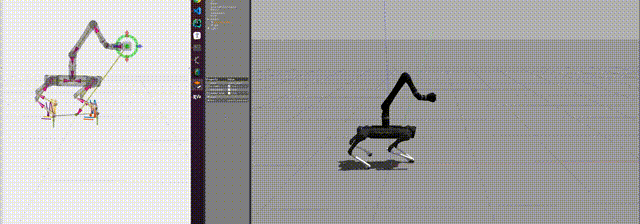

# Biography
I am Tianlin Zhang (张天霖), a graduate student at Harbin Institute of Technology (HIT), majoring in Robotics. 
I have extensive development experience with legged robots, UAVs, and mobile manipulators. 
I also pay attention to the research of optimal control, SLAM, vision servo, planning, and pose estimation. 
You can get my result video on [Youtube](https://www.youtube.com/channel/UCRsGxiYkqGvwHsZz1F8rHug) or [Bilibili](https://space.bilibili.com/3289375) (for China). 
You can also download my [Curriculum Vitae](https://skywoodsz.github.io/cv) to get more information about me.

# Selected projects
## [qm_control: a MPC and WBC framework for the quadruped manipulator](https://skywoodsz.github.io/projects/2023-qm-control/)

 | 
 | 

<!-- <table><tr>
<td></td>
<td></td>
</tr></table> -->

<!-- 

  

  

 -->

## [Aerial manipulator: vision servo for aerial manipulator](https://skywoodsz.github.io/projects/2021-aerial-manipualtor/)
